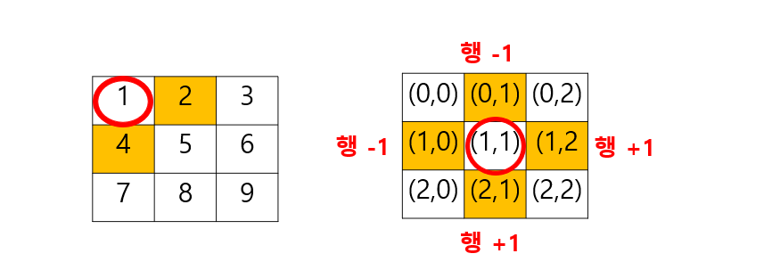
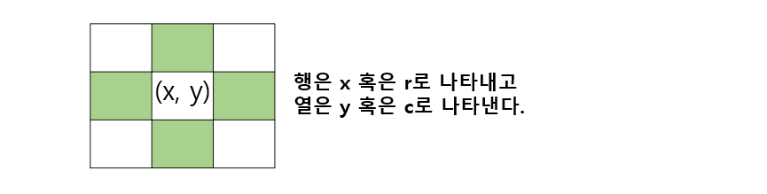
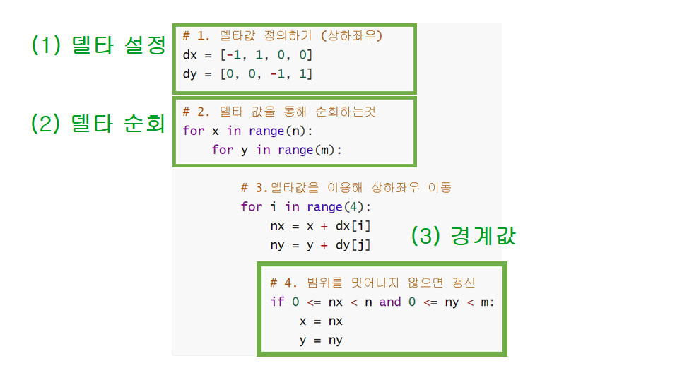

### ✔ 코드 리뷰 

: 파리퇴치, 어디에 들어갈 수 있을까 = 2차원리스트 (2차원 리스트는 무조건 익숙해져야 한다)

> 파리퇴치 

```python
#각 기준 좌표 순회하는 2중 반복문
for 기준행 in range(n):
	for 기준열 in range(n):
```

```python
영역합 = 0 
영역합 += 리스트[1][1]
영역합 += 리스트[1][2]
.
.


기준행 = 1
기준열 = 1
m = 2
영역합 = 0 
for 행 in range(1, 3):   # (기준행, 기준행+m)
	for 열 in range(1, 3): #(기준열, 기준열 +m)
		영역합 += 리스트[행][열]
        
if 영역합 > 최대영역합: # 최대 = max(최대, 영역합)으로 할 수 있지만, 모두 이해한 후 사용하기 
    최대영역합 = 영역합
 
```

```python
#최종 코드 

import sys

sys.stdin = open("_파리 퇴치.txt")

list_ = [
    [1, 3, 3, 6, 7],
    [8, 13, 9, 12, 8],
    [4, 16, 11, 12, 6],
    [2, 4, 1, 23, 2],
    [9, 13, 4, 7, 3],
]
N = 5
M = 2
최대영역합 = 0 

# 이중 리스트를 순회하는 이중 반복문
for 기준행 in range(N - M + 1):
    for 기준열 in range(N - M + 1):
        
        # 각 기준 좌표에서의 영역의 합 계산
        영역합 = 0
        for 행 in range(기준행, 기준행 + M):
            for 열 in range(기준열, 기준열 + M):
                영역합 += list_[행][열]

        # print(기준행,기준열,영역합)
        if 영역합 > 최대영역합:
            최대영역합 = 영역합 

print(최대영역합)

```


> 어디에 단어가 들어갈 수 있을까

```python
#조건1) 가로 혹은 세로로 정확히 빈 공간으 수가 k개라면 단어가 들어갈 수 있는 자리의 수 +1
#조건2) 중간에 벽이 있으면 빈공간의 수를 초기화 한다. 
#조건3) 벽 이전의 빈공간의 수가 k개라면 단어가 들어갈 수 있는 자리의 수 +1

# 자리의 수 k 조건을 보고 빈공간의 수를 초기화 

import sys

sys.stdin = open("_어디에단어가들어갈수있을까.txt")

빈공간 = 1
벽 = 0

N = 5
K = 2
list_ = [
    [1, 0, 0, 1, 0],
    [1, 1, 0, 1, 1],
    [1, 0, 1, 1, 1],
    [0, 1, 1, 0, 1],
    [0, 1, 1, 1, 0],
]
자리의수 = 0
# 이차원 리스트를 순회하기 위한 이중 반복문
for 행 in range(N):
    빈공간의수 = 0
    for 열 in range(N):
        if list_[행][열] == 빈공간:
            빈공간의수 += 1
        
        if list_[행][열] == 벽:
            # 1. 빈공간의수를 초기화하고 자리의수 조건 보기
            # 빈공간의수 = 0
            # if 빈공간의수 == K:
            #     자리의수 += 1
            

            # 2. 자리의수(K) 조건을 보고 빈공간의 수를 초기화
            if 빈공간의수 == K:
                자리의수 += 1
            빈공간의수 = 0


    # 하나의 행을 다 탐색하고나서
    # 빈공간의 수가 K개라면 단어가 들어갈 수 있는 자리의 수 + 1
    if 빈공간의수 == K:
        자리의수 += 1

for 열 in range(N):
    빈공간의수 = 0
    for 행 in range(N):
        if list_[행][열] == 빈공간:
            빈공간의수 += 1
        
        if list_[행][열] == 벽:
            # 1. 빈공간의수를 초기화하고 자리의수 조건 보기
            # 빈공간의수 = 0
            # if 빈공간의수 == K:
            #     자리의수 += 1
            

            # 2. 자리의수(K) 조건을 보고 빈공간의 수를 초기화
            if 빈공간의수 == K:
                자리의수 += 1
            빈공간의수 = 0

    # 하나의 행을 다 탐색하고나서
    # 빈공간의 수가 K개라면 단어가 들어갈 수 있는 자리의 수 + 1
    if 빈공간의수 == K:
        자리의수 += 1


print(자리의수)

```


---

---


### 📌 완전탐색 1 (Exhaustive Search)

> 가장 기본적으로 잘해야 하는 부분
>
> 완전탐색을 잘한다면, 코테 더 쉽게 다가올 수 있을 것 

> (1) 무식하게 다 풀기 (Brute force) 
>
> (2) 델타 탐색 


####  (1) 무식하게 다 풀기 (Brute force) 

모든 경우의 수를 탐색하여 문제를 해결하는 방식 

효율성으로 생각해 보았을때는 좋지 않을 때가 있다. 하지만 활용한다면, 접근하기가 쉽다.  

- 무식하게 밀어붙인다는 뜻
- 가장 단순한 풀이기법, 단순 조건문과 반복문을 이용해서 풀이 가능
- 복잡한 알고리즘 보다는, 아이디어를 어떻게 코드로 구현할 것인지가 중요 


| 추천 문제 백준 | 문제 이름 |
| :------------: | :-------: |
|  백준 2798번   |  블랙잭   |

> * 블랙잭 문제를 통해 완전탐색 이해하기 _ 배낭 채우기 문제와 비슷하다. 
>
> : 5장의 카드 5 6 7 8 9 중 세장의 카드의 합(max_total)이 21이 넘지 않아야 한다. _ 삼중 for문
>
> : 5 6 7 = 18 /  5 6 8 = 19 / 5 6 9 = 20 / 5 7 8 = 20 / 5 7 9 = 21 /  5 8 9 = 22 /  7 8 9 = 24


```python
#123 (5^)
for i in range(5):
	for j in range(5):
		for k in range(5):
# => 125
# O(n^3)
```


```python
#인덱스 마지막 두개는 돌지 않는다. 
#위에 있는 코드보다 작다 
#시간 복잡도 관점에서 위의 코드와 다음과 같은 코드와 같다. 
# O(n^3)
for i in range(3):
    # 0, 1, 2
    for j in range(i+1, 4):
        # 1, 2, 3
        for k in range(j+1, 5):
            # 2, 3, 4
```


```python
 #최종 코드 
 #완전탐색에 대한 이해를 해야한다. 
 #문제 자체를 분석한 다음 무식하게 하나씩 다 해보는 것이 중요하다. 
 #어떤 조합이 나올지 손으로 작성하면서 고민해보기 
 
    def blackjack(n, m, cards):
    # 가장 큰 합 
 	max_total = 0
    
    #완전탐색 
    for i in range(n - 2):
        for j in range(i + 1, n -1):
            for k in range(j + 1, n):
                total = cards[i] + cards[j] + cards[j]
                
                #현재 가장 큰 합보다는 크고, m을 넘지 않아야 갱신
                if max_total < total <= m:
                    max_total = total
                    
                #현재 m이 같으면 더이상 탐색하는 의미가 없으므로 종료 
                #21이 나오면 굳이 다 돌 필요가 없기 때문이다. 
                #불필요한 반복을 안해도 된다. 
                if total == m:
                    return total
        return max_total
    
    # 정리 
    # 3중 for문을 이용해 모든 경우의 수를 탐색 
    # i, j, k는 3장의 카드를 인덱스를 의미 
    # 중복으로 뽑는 경우를 방지하기 위해 range 범위 
    
```


---


#### (2) 델타 탐색 Delta Search

: 지금까지는 모든 경우의 수를 따지는 일반적인 완전탐색을 알아봄 

: **이차원 리스트의 완전탐색**에서 많이 등장하는 

: (0, 0)에서부터 이차원 리스트의 모든 원소를 순회하며(완전탐색)  **각 지점에서 상하좌우에 위치한 다른 지점을 조회하거나 이동**하는 방식 



: 이차원 리스트의 인덱스(좌표)의 조작을 통해서 상하좌우 탐색을 한다. 

: 이때 행과 열의 변량인 **-1, +1을** **델타delta값**이라 한다. 


##### ◼ 델타 값을 이용해 상하 좌우로 이동하기 



```python
# 행을 x, 열을 y로 표현
dx = [-1, 1, 0, 0]
dy = [0, 0, -1 1]

# 행을 r, 열을 x로 표현
dr= [-1, 1, 0, 0]
dx = [0, 0, -1, 1]
```


**◼ 델타 값을 이용해 상하좌우로 이동하기**

```python
# (1) 행을 x, 열을 y로 표현
dx = [-1, 1, 0, 0]
dy = [0, 0, -1, 1]
	 #상  하 좌 우 

# (2) 행을 r, 열을 c로 표현
dr = [-1, 1, 0, 0]
dc = [0, 0, -1, 1]

# 행은 x 혹은 y로 나타내고 
# 열은 y 혹은 x로 나타낸다. 
```


```python
# 상(x-1, y)
nx = x + dx[0]
ny = y + dy[0]

# 하(x+1, y)
nx = x + dx[1]
ny = y + dy[1]

# 좌(x, y-1)
nx = x + dx[2]
ny = y + dy[2]

# 우(x, y+1)
nx = x + dx[3]
ny = y + dy[3]
```


**◼ for 문을 이용하여 상하좌우 이동을 간단히 표현가능** 

```python
# 델타 값을 이용해 상하좌우 이동
for i in range(4):
	nx = x +dx[i]
	ny = y +dy[i]

# 범위를 벗어나지 않으면 갱신 _ 범위 바깥 부분은 제외 
# : 조건문이 굉장히 중요함 (⭐2. 범위를 벗어나지 않으면 갱신)
# : 범위 바깥 부분은 제외하는 것이 중요함 
if 0 <= nx < 3 and <= ny <3:
    x = nx
    y = ny
```


**◼ 이차원 리스트의 상하좌우 탐색 정리 ** 

```python
# 1. 델타값 정의하기 (상하좌우)
dx = [-1, 1, 0, 0]
dy = [0, 0, -1, 1]

# 2. 델타 값을 통해 순회하는것 
for x in range(n):
    for y in range(m):
        
        # 3.델타값을 이용해 상하좌우 이동 
        for i in range(4):
            nx = x + dx[i]
            ny = y + dy[j]
            
            # 4. 범위를 멋어나지 않으면 갱신 
            if 0 <= nx < n and 0 <= ny < m:
                x = nx
                y = ny
```




