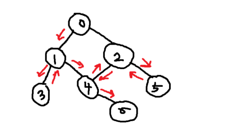

### ⚡ 깊이우선탐색 (DFS)

##### (1) 그래프 탐색 알고리즘 

: 지난 시간에 그래프 데이터 구조에 대해 학습

: 그래프의 자료구조 핵심은 **관계성**(**관계와 연결**)이다. 

: 데이터 구조는 알고리즘의 재료가 되어 **문제를 해결**하는데 사용된다. (**데이터 구조 => 알고리즘**)

* 그래프 데이터 구조는 어떤 알고리즘에 활용할 수 있을까? 

EX) 쾨니히스베르크 다리, 어떻게 하면 한번에 갈 수 있을까?  => 추상화(**abstract** : 추상)의작업 (컴퓨터공학) 

* 그래프 자료구조는 탐색 알고리즘에 활용된다. 

  * 그래프 탐색 알고리즘이란? 

  : 시작 정점에서 **간선을 타고 이동할 수 있는 모든 정점을 찾는** 알고리즘


◼ 그래프 탐색 알고리즘에는 깊이 우선탐색과 너비우선탐색이 있다. **(스택 + 그래프 + 큐)**

* 스택 + 그래프 : 깊이 우선탐색 

그래프의 깊이를 우선으로 탐색하기 위해 스택의 개념을 활용한다. 

* 큐 + 그래프 : 너비우선탐색 

그래프의 너비를 우선으로 탐색하기 위해 큐의 개념을 활용한다. 


* **깊이 우선탐색 DFS vs 너비 우선 탐색 BFS**

**◼ DFS vs BFS**

> DFS : 그래프의 깊이를 우선으로 탐색하기 위해 스택의 개념을 활용
>
> BFS : 그래프의 너비를 우선으로 탐색하기 위해 큐의 개념을 활용


* ##### 깊이 우선탐색 

시작 정점으로부터 갈 수 있는 하위 정점까지 가장 깊게 탐색하고, 더 이상 갈 곳이 없다면 마지막 갈림길로 돌아와서 다른 정점을 탐색하며 결국 모든 정점을 방문하는 순회방법


* ##### 깊이 우선탐색 특징 

모든 정점을 방문할 때 유리하다. 따라서 경우의 수, 순열과 조합 문제에서 많이 사용한다. 

너비우선탐색에 비해 코드 구현이 간단하다. 

단, 모든 정점을 방문할 필요가 없거나 최단 거리를 구하는 경우에는 너비우선 탐색이 유리하다. 


### DFS 동작과정 

: DFS 하기전에, 탐색을 진행할 그래프가 필요하다. 

그래프는 **인접행렬** 혹은 **인접리스트** 방식으로 표현이 가능하다. 



✔각 정점을 방문했는지 여부를 판별할 방문 체크 리스트가 필요하다. 

```python
visited = [False] * n 
#n은 정점의 개수 
```

| 0[i]  | 1[i]  | 3[i]  | 4[i]  | 5[i]  | 6[i]  |
| :---: | :---: | :---: | :---: | :---: | :---: |
| False | False | False | False | False | False |

사람과 달리 컴퓨터는 각 정점에 방문했는지 여부를 알 수 없다. 따라서 visited 리스트를 따로 선언하여 각 정점을 방문했는지 체크한다. 

```python
visited = [false, false, false, false, false, false, false]

# visited = [false] * 7
# visited = [0] * 7
```


##### [DFS 사이클] _ 각각 코드로 작성해보기 

(1) 현재 정점 방문처리 

```python
visited[0] = True
```

(2) 인접한 모든 정점 확인 

```python
graph[0]
# 1 2
```

(3) 방문하지 않은 인접 정점 이동

```python
visited[1] = True
graph[1] #3 4
```

(4) 방문 정점 순서 

> **0 - 1 - 3 - 4 - 2 - 5 - 6**


### 구현방식 

인접리스트로 표현한 그래프를 기준으로 설명한다. 

```python
graph = [
    [1, 2], 
    [0, 3, 4],
    [0, 4, 5],
    [1],
    [1, 2, 6],
    [2],
    [4]
]
```

```python
#반복문을 이용한 DFS

visited = [false] * n  #방문 처리 리스트 만들기 

visited[0] = True # 시작 정점 방문처리 
stack = [0] # 돌아갈 곳을 기록 

#def dfs(start): 
    #stack = [start] 
    #visited[start] = True 
    
    while len(stack) != 0:  # 스택이 빌때까지 (돌아갈 곳이 없을 때까지)반복
        cur = stack.pop() # 현재 방문 정점(후입선출)
        
        for adj in grah[cur]: # 인접한 모든 정점에 대한 
            if not visited[adj]: #아직 방문하지 않았당면 
                visited[adj] = True #방문처리 
                stack.append(adj) #스택에 넣느
```


```python
# 정리 

# 현재 노드가 0일때 
while len(stack) != 0:
    cur = stack.pop()
    # cur = 0
    
    for adj in gragh[cur]:
        if not visited[adj]:
            visited[adj] = True
            stack.append(adj)
            
            
"""
for adj in [1, 2]:
	if not visited [1]:
		visited[adj] = True
		stack.append(adj)
"""
```


---

**DFS 문제 풀이** 

백준 : 바이러스 

1단계 입력값을 받아 인접 리스트를 생성 

```python
n = int(input()) 
m = int(input())
gragh = [[]for _in range(n+1)] #[] 비워있는 이유는 0을 사용할 이유가 없기 때문 (0이 없다.)
visited = [false] * (n+1)
total = 0

#인접리스트 
for _ in range(m):
    v1, v2 = map(int, input().split())
    
```


2단계 1번 컴퓨터를 시작 정점으로 DFS 진행 

최종적으로 1번 컴퓨터에 의해 감염되는 컴퓨터는 2 3 5 6 (총4대)

True 숫자만 count 해주면 된다. 

```python
visited = [false] * n

def dfs(start):
	stack = [stack]
	visited[start] = True
	
	while stack:
		cur = stack.pop()
		
		for adj in gragh[cur]:
			if not visited[adj]:
			visited[adj] = True
			stack.append(adj)
            
dfs(1) # 1번 정점에서 시작
```


