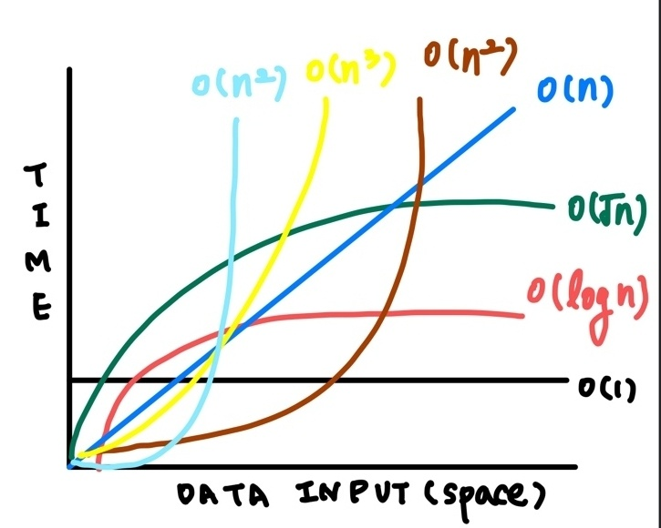
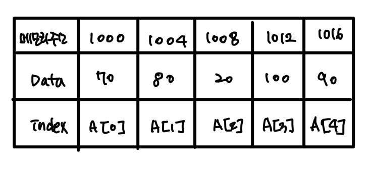
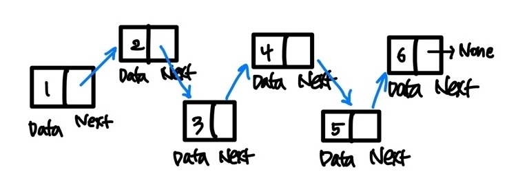
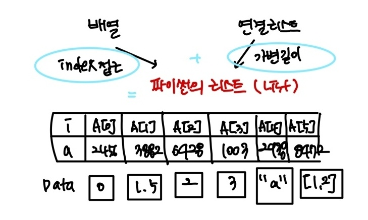

# 🔥 알고리즘 2DAY 🔥 

## ✔ 시간 복잡도 & 빅오 표기법 


#### 1. 알고리즘의 시간 복잡도 

* **좋은 알고리즘이란? 좋은 방법, 길이란 무엇일까?** 

**== 효율성이 좋은 알고리즘? _(적은 공간과 적은 시간)**

**== 성능이 좋은 알고리즘?**

**💁‍♀️ Answer** : **input을 넣은 후 output이 나오는 시간이 짧은 알고리즘!**


* **알고리즘의 소요시간 측정하기 (1)**

**같은 알고리즘인데 측정 시간이 다르다?** 

**💁‍♀️ Answer** : 개개인의 컴퓨팅 환경에 따라 **같은 알고리즘이라도 측정 시간이 다르다.** 

환경에 영향을 받지 않는 **객관적인 기준**이 필요하다. 


* **알고리즘의 소요 시간 측정하기 (2)**

> input => Algorithm => output

객관적인 측정을 위해 알고리즘 내부에서 **기본연산**이 **몇번** 일어나는지 살펴본다. 

```python
def count(word, char):
	total = 0 
	
	for i in word:
		if i == chr:
			total += 1
			
	return total 
	
# 기본 연산 : 단위 시간 1이 소요되는 시간 
# ⭐기본 연산의 총 횟수 == 알고리즘의 소요시간 
```

```python
# 아래와 같은 상황에서 몇 번의 기본 연산이 일어날까? 
# (== 알고리즘의 소요시간이 몇일까?) 5번!? 2번!? 어디가 기준이 되어야 하는가_

count("apple", "p")
>>> 2
```

👉 기본 연산의 횟수를 구하는 것은 환경에 영향을 받지 않는 객관적인 방법이지만, 

**입력의 개수**에 따라 시간이 달라진다는 문제가 있다. 

👉  따라서 성능을 측정할 때는 **입력을 통일** 시킨다. 가장 기본연산이 많이 일어나는 **최악의 입력** n개가 들어온다고 가정한다. 

> 최악의 입력 : count("aaaaa", "a")
>
> 매 반복마다 total += 1 연산 실행 

**💁‍♀️ Answer** : **입력 n개에 따른 소요 시간**을**(== 시간복잡도)** 수식으로 세울 수 있다. 


---


### 2. 시간 복잡도 Time Complexity 

**계산 복잡도 이론에서 시간 복잡도는 문제를 해결하는데 걸리는 시간과 입력의 함수 관계를 가리킨다.** 

단순하게 **알고리즘의 수행시간**을 의미한다고 

* 시간 복잡도가 높다 => 느린 알고리즘 

* 시간 복잡도가 낮다 => 빠른 알고리즘 


**◼ 시간 복잡도에 따라 알고리즘의 성능을 비교해 보자.** 

**count() 6n + 4 선형증가 vs count() 3n + 2 선형증가 vs count() 3n(2제곱) + 6n + 1 제곱으로 증가** 

> 2등 vs 3등 vs 1등
>
> 입력n이 무한대로 커진다고 가정하고 시간 복잡도를 간단하게 표시하는 것 
>
> 최고차항만 남기고 계수와 상수 제거 
>
> 매 입력에 따라 정확한 수식을 구하는 것은 불필요하다. 
>
> 정확한 수치보다는 증가율에 초점을 맞춘다. 

> 2등 vs 3등
>
> 따라서 우너래 둘의 소요시간은 2배 차이가 났지만 점근적 표기법에 의해 동일한 시간 복잡도를 나타낸다. 


**◼ 복잡한 정도** 


---


* **O(1)** : 단순 산술 계산 (덧셈, 뺄셈, 곱셈, 나눗셈)

> 단순계산  a + b, 100 * 200

* **O(longN)** : 크기 N인 리스트를 반절씩 순회/탐색 

> 이진탐색, 분할정복 

* **O(N)** : 크기 N인 리스트를 순회

> 리스트 순회, 1중 for문

* **O(NlogN)** : 크기 N인 리스트를 반절씩 탐색 * 순회

> 높은 성능의 정렬 (merge/quick/heap sort)

* **O(N^2)** : 크기 M, N인 2중 리스트를 순회

> 2중 리스트 순회, 2중 for문 

* **O(N^3)** : 3중 리스트를 순회

> 3중 리스트 순회, 3중 for문

* **O(2^N)** : 크기 N 집합의 부분 집합

> 크기가 N인 집합의 부분집합 

* **O(N!)** : 크기 N 리스트의 순열

> 크기가 N인 순열 

---


#### 📢 실제 문제에서는 어떻게 적용해 볼 수 있을까? 

> 실제 문제는 "초" 단위로 제한 시간이 주어지고 시간 복잡도도 정확하게 예측하기가 어렵다. 
>
> 따라서 어림짐작을 하는 방법을 알아야 한다. 
>
> 보통 1초에 1억번 연산으로 계산을 한다. 
>
> 입력의 개수에 따라 반복문을 몇 중으로 순회할 수 있는지 파악해야 한다. 


#### 📢 실제 문제에서는 어떻게 적용해 볼 수 있을까? 

> 가끔 for문을 1번만 사용했는데 왜 시간초과지? 
>
> = > for문이 1번이라고 해서 무조건 O(n)인 것은 아니다. for문 안에 O(n)의 내장 함수를 사용했다면 사실상 이중 for문과 다를 것이 없기 때문이다. 

---


### 3. Big-O 빅오 표기법



내장 함수, 메서드의 시간 복잡도도 확인 할 필요가 있다. 

**가끔 for문을 1번만 썼는데 왜 시간 초과가 날까요?** 라고 질문하는 분들이 있다. 

for문이 1번이라고 해서 무조건 O(n) 인 것은 아니다. 

for문 안에  O(n)의 내장 함수를 사용했다면 사실상 **이중 for문**과 다를 것이 없기 때문이다. 

  **=> "일단 코드를 작성하는데 집중하고 수정하자."** 

* [time complexity](https://en.wikipedia.org/wiki/Time_complexity)

* [time complexity](https://wiki.python.org/moin/TimeComplexity)

---

### 4. 리스트 list 

#### **(1) 배열 vs 연결리스트** 

* **배열 Array** 

  : 요일마다 먹는 약통💊을 생각해 보자 

  : **여러 데이터들이 연속된 메모리 공간에 저장되어 있는 자료구조** 

  : 인덱스를 통해 데이터에 빠르게 접근 

  : 배열의 길이는 변경이 불가능 => 길이를 변경하고 싶다면 새로 생성 

  : 데이터 타입은 고정 

  ```python
  int arr[5] = {70, 80, 20, 100, 90}
  ```

  




* **연결 리스트 Linked List**

  : 데이터가 담긴 여러 노드들이 순차적으로 연결도니 형태의 자료구조 

  : 맨처음 노드부터 순차적으로 탐색 

  : 연결 리스트의 길이 자유롭게 변경 가능 => 삽입, 삭제가 편리 

  : 다양한 데이터 타입 저장 

  : 데이터가 메모리에 연속적으로 저장되지 않음 

  

---



---


### 5. 파이썬의 리스트

: 리스트를 **stack으로 구현**할 수 있지만 리스트가 이미 다 할 수 있기때문에 복잡하게 구현할 필요없다.

* **.append()** **O(1)**  **return 값이 없다.**

  : 리스트 맨 끝에 새로운 원소 **삽입**

* **.pop()**  **O(1)**   **return 값이 있다.** 

​		: 특정 인덱스에 있는 원소를 **삭제 및 반환** 


**◼ .append(원소)**

```python
#리스트 맨 끝에 새로운 원소 삽입
a = [1, 2, 3, 4, 5]
a.append(6)
print(a)

#출력 : [1, 2, 3, 4, 5, 6]

a = [1, 2, 3, 4, 5]
a.append(["a", "b"])
print(a)
```


**◼ .pop(인덱스)**

```python
# 특정 인덱스에 있는 원소를 삭제 및 반환 
a = [1, 2, 3, 4, 5]
b = a.pop()

print(a)
print(b)

#출력 
# [1, 2, 3, 4]
# 5

a = [1, 2, 3, 4, 5]
b = a.pop(2)

print(a)
print(b)

#출력 
# [1, 2, 4, 5]
# 3
```


◼ **.count(원소)**

```python
# 리스트에서 해당 원소의 개수를 반환 

a = [1, 2, 2, 3, 3, 3]
print(a, count(2))

# 출력 : 2

a = [1, 2, 2, 3, 3, 3]
print(a, count(3)
# 출력 : 2
```


◼ **.index(원소)**

```python
# 리스트에서 처음으로 원소가 등장하는 인덱스 반환 

a = [1, 2, 3, 4, 5]
print(a.index(2))
#출력 : 1

a = [1, 2, 3, 4, 5]
print(a.index(8))
# ValueError
```


◼ **.sort()**

```python
# 리스트를 오름차순으로 정렬 
# reverse = True 옵션을 통해 내림차순으로 정렬가능 

a = [5, 2, 4, 0, -1]
a.sort()
print(a)
# 출력 : [-1, 0, 2, 4, 5]

a = [5, 2, 4, 0, -1]
a.sort(reverse = True)
print(a)
# 출력 : [5, 4, 2, 0, -1]
```


◼ **.reverse()**

```python
# 리스트의 원소들의 순서를 거꾸로 뒤집기 
a = [1, 2, 3, 4, 5]
a.reverse()
print(a)
#출력 [5, 4, 3, 2, 1]
```


◼ **len(iterable)**

```python
# 리스트의 길이(원소의 개수)를 반환

a = [1, 2, 3, 4, 5]
print(len(a))
# 출력 5
```


◼ **sum(iterable)**

```python
# 리스트의 모든 원소의 합을 반환 
a = [1, 2, 3, 4, 5]
print(sum(a))
# 출력 15
```


◼ **max(iterable)**

```python
# 리스트의 원소 중 최대값을 반환
a = [1, 2, 3, 4, 5]
print(max(a))
#출력 : 5
```


◼ **min(iterable)**

```python
# 리스트의 원소 중 최소값을 반환 
a = [1, 2, 3, 4, 5]
print(min(a))
#출력 : 1
```


◼ **sorted(iterable)**

```python
# 오름차순으로 정렬된 새로운 리스트 반환 
# 반환 리스트는 변화 없음 

a = [5, 2, -1, 0, 1]
b = sorted(a)
c = sorted(a, reverse = True)

print(a) # 원본 [5, 2, -1, 0, 1]
print(b) # 오름차순 정렬 [-1, 0, 1, 2, 5]
print(c) # 내림차순 정렬 [5, 2, 1, 0, -1]
```


◼ **reversed(iterable)**

```python
# 리스트의 순서를 거꾸로 뒤집은 새로운 객체 반환 
# 원본 리스트는 변화 없음 

a = [1, 2, 3, 4, 5]
b = reversed(a)
c = list(reversed(a))

print(a) # 원본 [1, 2, 3, 4, 5]
print(b) # reversed(a) <list_reverseliterator object at 0x00000298CE25E740>
print(c) # list(reversed(a)) [5, 4, 3, 2, 1]
```


---

#### 🔹 자주 쓰이는 리스트 관련 내장함수 

**len(), sum(), max(), min(), sorted(), reverse()**

---


### 6. 리스트 관련 내장함수 연습 

| 문제 번호  | 문제        |
| ---------- | ----------- |
| BOJ 108818 | 최소, 최대  |
| BOJ 11720  | 숫자의 합   |
| BOJ 2750   | 수 정렬하기 |


---


### 7. 리스트 컴프리헨션 _ List Comprehension

> 코드 한 줄만으로 새로운 리스트를 만드는 방법

```python
numbers = []
for i in range(5):
	numbers.append(i)
    
# 이 부분을 한 줄로 만들어 본다면? 
numbers = [i for i in range(5)]

# if 문으로 필터링도 가능하다. 
odd_numbers = [i for i in range(10) if i % 2 == 1]
print(odd_numbers)
```


### 8. 리스트 컴프리헨션 연습 

| 문제 번호 | 문제   |
| --------- | ------ |
| BOJ 2562  | 최댓값 |


----


### 🛠 [리스트 자료형과 메서드의 시간 복잡도](https://chancoding.tistory.com/43)

|      | Exampl        | Example       | Class       | Notes                                   |
| ---- | ------------- | ------------- | ----------- | --------------------------------------- |
| 1    | Index         | l[i]          | O(1)        | 인덱스로 값 찾기                        |
| 2    | Store         | l[i] = 0      | O(1)        | 인덱스로 데이터 저장                    |
| 3    | Length        | len(l)        | O(1)        | 리스트 길이                             |
| 4    | Append        | l.append(5)   | O(1)        | 리스드 뒤에 데이터 저장                 |
| 5    | Pop           | l.pop()       | O(1)        | 가장 뒤의 데이터 pop                    |
| 6    | Clear         | l.clear()     | O(1)        | l = []                                  |
| 7    | Slice         | l[a:b]        | O(b-a)      | 슬라이싱되는 요소들 수 만큼 비례        |
| 8    | Extend        | l.extend(...) | O(len(...)) | 확장되는 길이만큼                       |
| 9    | Construction  | list(...)     | O(len(...)) | 리스트 길이만큼                         |
| 10   | check ==, !=  | l1 == l2      | O(N)        | 전체 리스트가 동일한지 확인             |
| 11   | Insert        | l[a:b] = ...  | O(N)        | 데이터 삽입                             |
| 12   | Delete        | del l[i]      | O(N)        | 데이터 삭제                             |
| 13   | Containment   | x in/not in l | O(N)        | 포함 여부 확인                          |
| 14   | Copy          | l.copy()      | O(N)        | 복제                                    |
| 15   | Remove        | l.remove(...) | O(N)        | 제거                                    |
| 16   | Pop           | l.pop(i)      | O(N)        | 제거된 값 이후를 전부 한칸씩 당겨줘야함 |
| 17   | Extreme value | min(l)/max(l) | O(N)        | 전체 데이터를 확인해야함                |
| 18   | Reverse       | l.reverse()   | O(N)        | 뒤집기                                  |
| 19   | Iteration     | for v in l:   | O(N)        | 전체 데이터 확인하므로                  |
| 20   | Sort          | l.sort()      | O(N Log N)  | 파이썬 기본 정렬 알고리즘               |
| 21   | Multiply      | k*l           | O(k N)      | 리스트의 곱은 리스트 개수 늘어남        |


### 🛠 [집합(set)자료형과 메소드의 시간 복잡도](https://chancoding.tistory.com/43)

|      | Operation      | Example       | Class            | Notes                    |
| ---- | -------------- | ------------- | ---------------- | ------------------------ |
| 1    | Add            | s.add(5)      | O(1)             | 집합 요소 추가           |
| 2    | Containment    | x in/not in s | O(1)             | 포함 여부 확인           |
| 3    | Remove         | s.remove(..)  | O(1)             | 요소 제거                |
| 4    | Discard        | s.discard(..) | O(1)             | 특정 요소 제거           |
| 5    | Pop            | s.pop()       | O(1)             | 랜덤하게 하나 pop        |
| 6    | Clear          | s.clear()     | O(1)             | similar to s = set()     |
| 7    | Construction   | set(...)      | O(len(...))      | 길이만큼                 |
| 8    | check ==, !=   | s != t        | O(len(s))        | 전체 요소 동일 여부 확인 |
| 9    | <=/<           | s <= t        | O(len(s))        | 부분집합 여부            |
| 10   | >=/>           | s >= t        | O(len(t))        | 부분집합 여부            |
| 11   | Union          | s, t          | O(len(s)+len(t)) | 합집합                   |
| 12   | Intersection   | s & t         | O(len(s)+len(t)) | 교집합                   |
| 13   | Difference     | s - t         | O(len(s)+len(t)) | 차집합                   |
| 14   | Symmetric Diff | s ^ t         | O(len(s)+len(t)) | 여집합                   |
| 15   | Iteration      | for v in s:   | O(N)             | 전체 요소 순회           |
| 16   | Copy           | s.copy()      | O(N)             | 복제                     |

