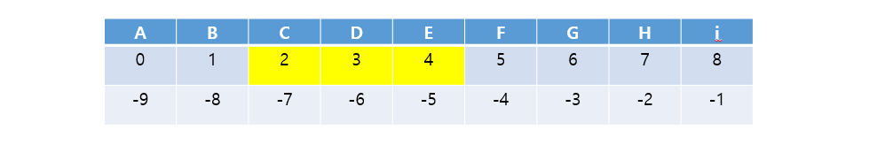
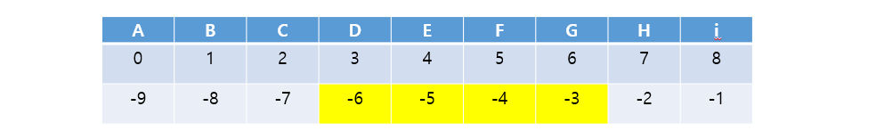
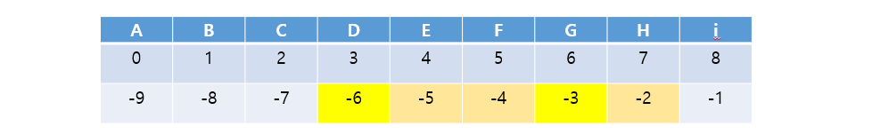
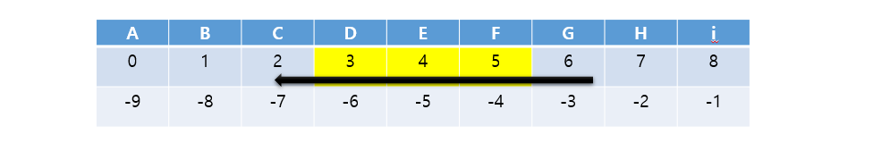

### 📌 문자열 String

> 문자열 슬라이싱, 문자열 메서드, 아스키코드

* 문자열은 **immutabel (변경불가능한)** 자료형

```python
word = "apple"
print(word)
print(id(word))
>>> apple
>>> 1352749370800 메모리 주소

word += "banana"
print(word)
print(id(word))
>>> apple banana
>>> 1352749417520 메모리 주소
```


#### (1) 문자열 슬라이싱 

```python
s = 'abcdrfghi'
```


#### ✂ s[2:5] 'cde'



#### ✂ s[-6:-2] ' defg'




#### ✂ s[2:-4] 'cde'


#### ✂ s[2:5:2] 'ce'


#### ✂ s[-6: -1 : 3] 'dg'



#### ✂ s[2:5:-1] ''


#### ✂ s[5:2:-1] 'fed'



#### ✂ s[:3] 'abc'

#### ✂ s[:5] 'fghi'


#### ✂ s[:] 'abcdefghi'


#### ✂ s[::-1] 'ihgfedcba'


#### ✂ s[10:20]  ' '


---

| 문제 번호 | 문제                  |
| --------- | --------------------- |
| BOJ 10988 | 펠린드롬인지 확인하기 |

---


### (2) 문자열 메소드 

**.split() .strip() .find() .index() .count() .replace()**


◼ **.split(기준 문자)**

```python
# 문자열을 일정 기준으로 나누어 리스트로 반환
# 괄호 안에 아무것도 넣지 않으면 자동으로 공백을 기준으로 설정 

word = "i play the piano"
print(word.split())
#출력 : ['i', 'play', 'the', 'piano']

word = "apple, banana, orange, grape"
print(word.split(","))
#출력 : ['apple', 'banana', 'orange', 'grape']

word = "This_is_snake_case"
print(word.split("_"))
#출력 : ['This', 'is', 'snake', 'case']
```


◼**.strip(제거할 문자)**

```python
# 문자열의 양쪽 끝에 있는 특정 문자를 모두 제거한 새로운 문자열 반환
# 괄호안에 아무것도 넣지 않으며 자동으로 공백을 제거 문자로 설정 
# 제거할 문자를 여러 개 넣으면 해당하는 모든 문자들을 제거 
```

```python
word = "hello word"
print(word.strip())
# 출력 : hello world

word = "ahello worlda"
print(word.strip("a"))
# 출력 : hello world

word = "hello world"
print(word.strip("hd"))
# 출력 : ello worl

word = "hello worldddddd"
print(word.strip("d"))
# 출력 : fello worl
```


◼ **.find(찾는문자)**

```python
# 특정 문자가 처음으로 나타나는 위치(인덱스)를 반환 
# 찾는 문자가 없다면 -1을 반환 

# VS index()
# 특정 문자가 처음으로 나타나는 위치(인덱스)를 반환 
# 찾는 문자가 없다면 오류 발생
```

```python
word = "apple"
print(word.find("p"))
# 출력 : 1

word = "apple"
print(word.find("k"))
# 출력 : -1
```


◼ **.index(찾는문자)**

```python
# 특정 문자가 처음으로 나타나는 위치(인덱스)를 반환 
# 찾는 문자가 없다면 오류 발생 
```

```python
word = "apple"
print(word.index("p"))
# 출력 : 1

word = "apple"
print(word.index("k"))
# valueerror
```


◼ **.count(개수를 셀 문자)**

```python
# 문자열에서 특정 문자가 몇개인지 반환 
# 문자 뿐만 아니라, 문자열의 개수도 확인 가능
```

```python
word = "banana"
print(word.count("a"))
# 출력 : 3

word = "banana"
print(word.count("na"))
# 출력 : 2

word = "banana"
print(word.count("ana"))
# 출력 : 1
```


◼ **.replace(기존문자, 새로운문자)**

```python
# 문자열에서 기존 문자를 새로운 문자로 수정한 새로운 문자열 반환 
# 특정 문자를 빈 문자열(" ")로 수정하여 망치 해당 문자를 삭제한 것 같은 효과 가능
```

```python
word = "happyending"
print(word.relace("happy", "ending"))
#출력 : endinghappy

word = "happyending"
print(word.replace("h", "H"))
#출력 : Happyending

word = "happyending"
print(word.replace("happy", ""))
#출력 : ending
```


◼**삽입할 문자. join(iterable)** **vs** ____**split()**

```python
# iterable의 각각 원소 사이에 특정 문자를 삽입한 새로운 문자열 번호나 
# 공백 출력, 콤마 출력 등 원나는 출력 형태를 위해 사용 
```

```python
word = "happyending"
print(" ".join(word))
#출력 : h a p p y e n d i n g

word = "happyending"
print(",".join(word))
#출력 : h,a,p,p,y,e,n,d,i,n,g

word = ["su" "suoio.github"]
print("@".join(word))
#출력 : su@suoio.github

word = ["h", "a", "p", "p", "y"]
print("".join(words))
#출력 : happy
```


---

| 문제 번호 | 문제            |
| --------- | --------------- |
| BOJ 17249 | 태보태보 총난타 |

---


### (3) 아스키 ASCII 코드 

* **비트 bit**  : 0과 1 두가지 정보만 표현

* **바이트 byte** :  데이터를 저장하는 기본 단위 **(1byte == 8bits)** _ 1 0 1 1 0 0 0 1
*  **그렇다면 문자는 어떻게 저장될까?**

 : American Standard Code for Information Interchange = **ASCII**(미국 정보교환 표준부호)

= **알파벳을 표현하는 대표 인코딩 방식** 

= 각 문자를 표현하는데 **1byte(8bits)** 사용 (1bit 통신에러 검출용 / 7bit 문자 정보저장 총 128개)


**◼ ord (문자)**

```python
# 문자 _ 아스키코드로 변환하는 내장함수 

print(ord("A")) #65
print(ord("a")) #97
```


**◼ chr(아스키코드)**

```python
# 아스키코드 _ 문자로 변환하는 내장함수 

print(chr("65")) #A
print(chr("97")) #a
```


---

| 문제 번호 | 문제        |
| --------- | ----------- |
| BOJ 10809 | 알파벳 찾기 |

---

