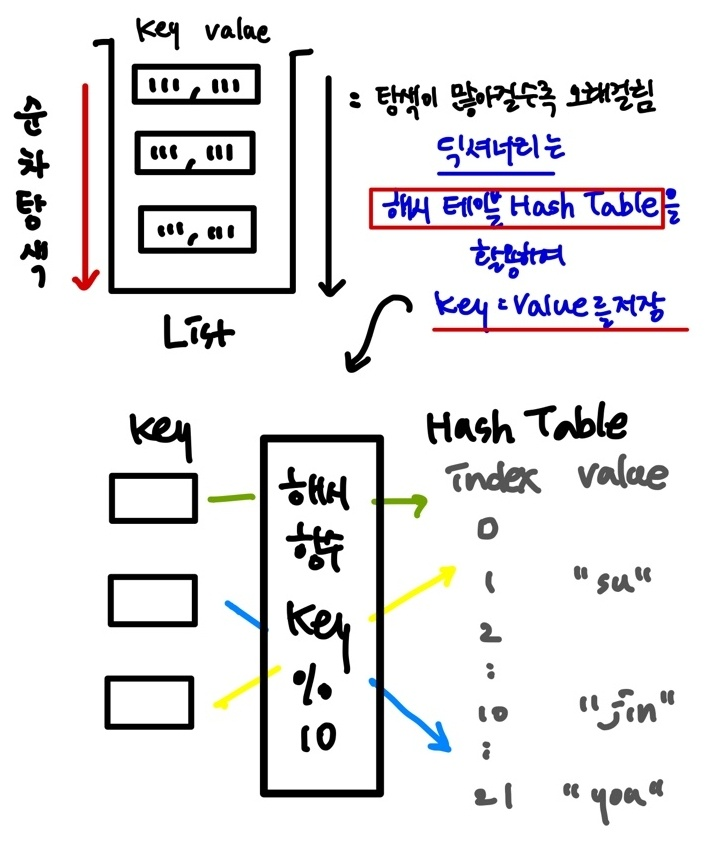
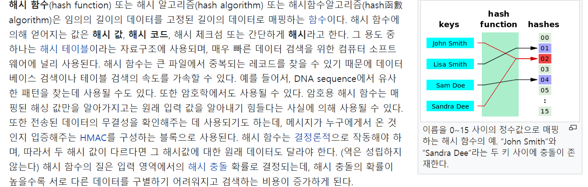

### 📌 딕셔너리 Dictionary

* string substring
* python string compare time compriexity

* [문자열] 슬라이싱 복습  

---

> 1. **해시테이블,  2. 딕셔너리 기본 문법, 3. 딕셔너리 메서드** 


#### (1) 해시테이블

**파이썬에는 딕셔너리 dict 자료구조가 내장 되어 있다.** 

**non-sequence & key value**  

```python
{
"name" : "kt"
"gender" : "male"
"address" : "seoul"
}

# key는 immutable(변경불가능)
# 순서가 없다. 
```


#### ◼ **key : value 가 저장되는 원리는 무엇일까? _ 일단 리스트🔻를 활용하여 key : value를 저장하자.** 




#### ◼ 해시 함수 : 임의 길이의 데이터를 고정 길이의 데이터로 매핑하는 함수 

#### ◼ 해시 : 해시 함수를 통해 얻어진 값




#### ◼ 해시 함수와 해시 테이블을 이용하기 때문에 삽입, 삭제, 수정, 조회 **연산의 속도가 리스트 보다 빠르다.** 

#### ◼ (Hash function을 이용한 산술 계산으로 값이 있는 위치를 바로 알 수 있기 때문)

---


#### ◼ ⭐ 딕셔너리 연산의 시간 복잡도 = 절대 기억하기!!!

| 연산 종류   | 딕셔너리 | 리스트         |
| ----------- | -------- | -------------- |
| get item    | O(1)     | O(1)           |
| insert item | O(1)     | O(1) 또는 O(N) |
| update item | O(1)     | O(1)           |
| delete item | O(1)     | O(1) 또는 O(N) |
| search item | O(1)     | O(N)           |

**Q. 리스트 에서 O(1) 또는 O(n) 일까?** 

= 언제 넣는냐에 따라 다르기 때문이다. 


**Q. 딕셔너리는 언제 사용해야 할까?**

- 리스트를 사용하기 힘든 경우 (알고리즘)
- 데이터에 대한 빠른 접근 탐색이 필요한 경우  (알고리즘)
- 현실  세계의 대부분의 데이터를 다룰 경우 


---

### (2) 딕셔너리 기본 문법


##### **◼ 선언 ___ 변수 = {key1: value1, key2: value2 .....}**

```python
a = {
    "name" : "su"
    "gender" : "f"
    "address" : "Seoul"
}
print(a)
#출력 : {'name': 'su', 'gender': 'f', 'address' : 'Seoul'}
```


##### ◼ 딕셔너리 [key] = value

**⭐ 내부에 해당 key가 없으면 삽입, 있으면 수정 (무조건 암기)**

```python
# 삽입
a = {
    "name" : "su"
    "gender" : "f"
    "address" : "Seoul"
}
a["job"] = "Fullstack developer"
print(a)

#출력 
{'name': 'su', 'gender': 'f', 'address' : 'Seoul', 'job' : 'Fullstack developer'}
```

```python
# 수정
a = {
    "name" : "su"
    "gender" : "f"
    "address" : "Seoul"
}
a["name"] = "kyung"
print(a)

#출력 
{'name': 'kyung', 'gender': 'f', 'address' : 'Seoul'}
```


##### ◼ 딕셔너리.pop(key) 삭제 

##### 내부에 존재하는 key에 대한 value 삭제 및 반환, 존재하지 않는 key에 대해서는 keyerror 발생 

```python
a = {
    "name" : "su"
    "gender" : "f"
    "address" : "Seoul"
}
gender = a.pop("gender")

print(a)
print(gender)

#출력 
{'name': 'kyung',  'address' : 'Seoul'}
f
```

```python
a = {
    "name" : "su"
    "gender" : "f"
    "address" : "Seoul"
}
phone = a.pop("phone")

print(a)
print(phone)

# keyerror 발생 
```


##### ◼ 딕셔너리.pop(key, default) 삭제 

##### 두번째 인자로 default값을 지정하여 keyerror 방지 가능 

(default  값을 지정해주면 중간에 멈추는 것을 방지해줌)

```python
a = {
    "name" : "su"
    "gender" : "f"
    "address" : "Seoul"
}
phone = a.pop("phone", "010-8666-0000")

print(a)
print(phone)

#출력 : 
# {'name': 'su', 'gender': 'f', 'address' : 'Seoul'}
# 010-8666-0000
```


##### ◼  key 에 해당하는 value 반환 

```python
# 딕셔너리 [key]
a = {
    "name" : "su"
    "gender" : "f"
    "address" : "Seoul"
}
print(a["name"])

#출력 : su
```

#####  

```python
# 딕셔너리 .get(key)
a = {
    "name" : "su"
    "gender" : "f"
    "address" : "Seoul"
}
print(a.get("name"))
#출력 : su
```


##### ◼  기본적인 딕셔너리 사용법 _조회

```python
# 딕셔너리 [key]
a = {
    "name" : "su"
    "gender" : "f"
    "address" : "Seoul"
}
pritn(a["phone"])

#keyerror
```

```python
# 위의 딕셔너리 [key] 와 비교해보기 
# 딕셔너리 .get(key)

a = {
    "name" : "su"
    "gender" : "f"
    "address" : "Seoul"
}
pritn(a.get["phone"])
#출력 : none

a = {
    "name" : "su"
    "gender" : "f"
    "address" : "Seoul"
}
print(a.get("phone", "없음"))

#출력 : 없음

```


##### 💁‍♀️ 딕셔너리 기본 문법 정리 

|    **선언**     |   **변수 = {key1: value1, key2: value2 .....}**    |
| :-------------: | :------------------------------------------------: |
| **삽입 / 수정** |             **딕셔너리 [key] = value**             |
|    **삭제**     |           **딕셔너리.pop(key, default)**           |
|    **조회**     | **딕셔너리 [key]  /  딕셔너리 .get(key, default)** |


---


### 3. 딕셔너리 메서드 

**(1) .keys()** **: 딕셔너리 key목록이 담긴 dict_keys 객체 반환** 

```python

a = {
    "name" : "su"
    "gender" : "f"
    "address" : "Seoul"
}
print(a.keys())

# 출력
# dict_keys(['name', 'gender', 'address'])
```

```python
a = {
    "name" : "su"
    "gender" : "f"
    "address" : "Seoul"
}

for key in a.keys():
    print(key)

# 출력 
# name
# gender
# address
```

```python
a = {
    "name" : "su"
    "gender" : "f"
    "address" : "Seoul"
}
for key in a:
    print(key)
    
# 출력 
# name
# gender
# address   
```


**(2) .values() : 딕셔너리 value 목록이 담긴 dict_values 객체 반환** 

```python
a = {
    "name" : "su"
    "gender" : "f"
    "address" : "Seoul"
}
print(a.values())

# 출력 
# dict_values(['su', 'f', 'Seoul'])
```

```python
a = {
    "name" : "su"
    "gender" : "f"
    "address" : "Seoul"
}
for value in a.values():
    print(values)
    
# 출력 
# su
# f
# Seoul
```


**(3) .items() : 딕셔너리의 (key, value) 쌍 목록이 감긴 dict_items 객체 반환** 

```python
a = {
    "name" : "su"
    "gender" : "f"
    "address" : "Seoul"
}
print(a.items())

#출력 
dict_items([('name', 'su'), ('gender', 'f'), ('address', 'Seoul')])
```

```python
a = {
    "name" : "su"
    "gender" : "f"
    "address" : "Seoul"
}

for item in a.items():
    print(item)

# ('name', 'su')
# ('gender', 'f')
# ('address', 'Seoul')
```

```python
a = {
    "name" : "su"
    "gender" : "f"
    "address" : "Seoul"
}

for key, value in a.items():
    print(key, value)

# name su
# gender f
# address Seoul
```

