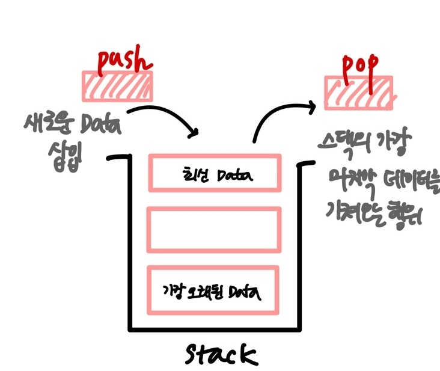
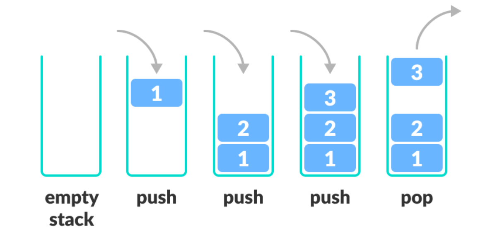
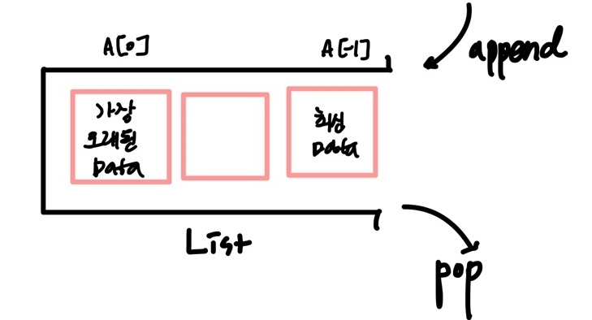
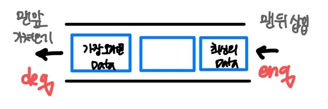
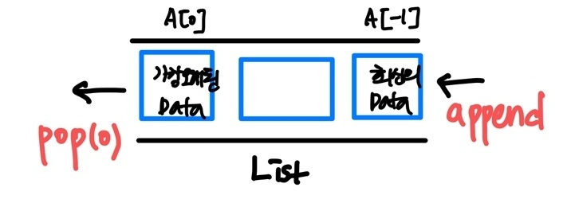
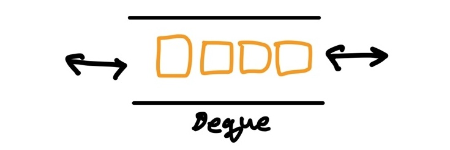
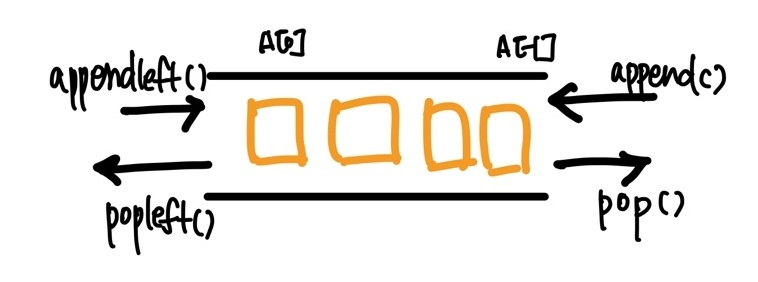

### ✔ 지난 프로젝트 암호문_코드리뷰 

```python
# list 메소드 중에 insert(삽입위치, 값)을 넣으면 원하는 위치에 넣을 수 있다. 

명령어 = 명령어리스트[0]
if 명령어 == "I"
	삽입_인덱스 = 명령어리스트[0 + 1]
    숫자_리스트_길이 = 명령어리스트[0 + 2]
    숫자_리스트 = 명령어리스트[0 + 3 : 0 + 3 + y]
    
    for 숫자 in 숫자_리스트[::-1]:
        암호문.insert(삽입_인덱스, 숫자)
        
    0 => 1
```

```python

        import sys
sys.stdin = open("input.txt")

"""
11
449047 855428 425117 532416 358612 929816 313459 311433 472478 589139 568205 
7
I 1 5 400905 139831 966064 336948 119288 
I 8 6 436704 702451 762737 557561 810021 771706 
I 3 8 389953 706628 552108 238749 661021 498160 493414 377808 
I 13 4 237017 301569 243869 252994 
I 3 4 408347 618608 822798 370982 
I 8 2 424216 356268 
I 4 10 512816 992679 693002 835918 768525 949227 628969 521945 839380 479976 
"""

T = 10
# ctrl + d
# 원본암호문 = [449047,855428,425117,532416,358612,929816,313459,311433,472478,589139,568205]

for t in range(1, T+1):
    origin_len = int(input())
    origin_list = list(map(int, input().split()))

    command_len = int(input())
    command_list = input().split()

    # i의 초기화
    i = 0
    
    # while문 (반복문)
    while i < len(command_list):
        command = command_list[i]
        if command == "I":
            # x,y,숫자리스트 s 구해야한다.
            x = int(command_list[i+1])
            y = int(command_list[i+2])
            # print(type(y))
            number_list = command_list[i+3 : i+3+y]

            # insert 메서드를 써서 x의 위치에 숫자들을 삽입한다.
            # 역순으로 삽입한다.
            for number in number_list[::-1]:
                origin_list.insert(x, int(number))

        # 0 + 1 -> 1
        i = i + 1
    

    # print(origin_list[:10])
    print(f"#{t}",*origin_list[:10])
```


---


#### 🔔Mental care

##### 1. 너무 욕심없이 잘할려고 하기보다 버티기 _ 존버

##### 2. 포기만 안하면 잘하고 있다고 생각하기 _ 유학왔다고 생각하기 

##### 3. 해시, 스택/큐, 힙, 완전탐색, 깊이/너비 우선탐색(DFS/BFS) = 이정도 잡아가면 코테 통과한다. 

##### 4. 동적계획법, 탑욕법 = 재귀 


---


#### 🔔복습

**[알고리즘 1주차에 배운 내용] : 배열, 연결 리스트, 해시**

**[심화] : 심화는 개인적으로 추가로 공부 계속 이어나기기** **_ 관련된 자료 제공할 예정 _ 심화보다 기초가 중요!!**

**[⭐왜 써야하는지] : 데이터 구조를 배우는 이유 _ 왜 만들어졌고 언제 써야하는지 알기위해 _ 중요한 point**


---


### 🔻 스택, 큐(stack_범위, queue _ 줄을서다)

#### 1. 스택 Stack

**[⭐왜 써야하는지 WHY ]** : 데이터 구조를 배우는 이유 _ 왜 만들어졌고 언제 써야하는지 알기위해 _ 중요한 point

> stack은 쌓는다는 의미로써, 마치 접시를 쌓고 빼듯이 **데이터를 한쪽에서만 넣고 빼는 자료구조** 

> 가장 마지막에 들어온 데이터가 가장 먼저 나가므로 **LIFO(LAST IN FIRST OUT, 후입선출) 방식**


* 스택 자료구조의 대표동작 

> 스택에 새로운 데이터를 삽입하는 행위 PUSH / 스택의 가장 마지막 데이터를 가져오는 행위 POP



#### (1) **STACK이 필요한 이유** == **STACK의 USE CASE**

**1_ 뒤집기, 되돌리기, 되돌아가기** 

>  데이터가 반대로 정렬되어야 하거나 뒤집어지는 형태가 되어야 하는 경우 / **'단어 뒤집기'** 

> 브라우저에서 **''뒤로가기''** 같은 기능을 생각해 볼 수 있다. _ 브라우저 히스토리 

> 문서 작성중 잘못 입력한 경우 **'ctrl + z'** 을 눌러 마지막으로 저장되어진 사항이 하나씩 돌아가게 된다. 


##### 2. 마무리 되지 않은 일을 임시 저장 

> 마무리 되지 않은 일을  않으면 일단 stack에 저장해 두면 천천히 꺼내 사용하기 _ **임시저장**

> * **괄호 매칭**(열렸는데 닫히지 않는 괄호가 있는지)
>
> * **함수 호출**(재귀 호출)
>
> * **백트래킹**(미로찾기, 실험을 해봤다가 아니면 돌아가기)  
> * **DFS(깊이 우선 탐색)** 

```python
# 함수 호출 
# 끝나지 않은(=마무리 되지 않은) 함수 찾아가기
print(sum(max(min(2, 5), 10), min(2, 5)))
print(sum(max(2, 5), 10), min(2, 5))
print(sum(max(10), min(2, 5))
print(sum(10), min(2, 5))
print(12)
```


##### 3. 파이썬은 리스트(list)로 스택을 간편하게 사용할 수 있다. 

>  append 시간 복잡도 = 상수 복잡도 **O(1)**

>  pop 시간 복잡도 (까다로움) = 상수 복잡도 **O(1)** / 중간에 있는 것을 pop 하려면 **O(n)**이다. 






---


#####  4. 스택 문제 연습 _ 백준 _10773번 제로

* 문제 내용

> 나코더 기장 재민이는 동아리 회식을 준비하기 위해서 장부를 관리하는 중이다.
>
> 재현이는 재민이를 도와서 돈을 관리하는 중인데, 애석하게도 항상 정신없는 재현이는 돈을 실수로 잘못 부르는 사고를 치기 일쑤였다.
>
> 재현이는 잘못된 수를 부를 때마다 0을 외쳐서, 가장 최근에 재민이가 쓴 수를 지우게 시킨다.
>
> 재민이는 이렇게 모든 수를 받아 적은 후 그 수의 합을 알고 싶어 한다. 재민이를 도와주자!

* 입력 

> 첫 번째 줄에 정수 K가 주어진다. (1 ≤ K ≤ 100,000)
>
> 이후 K개의 줄에 정수가 1개씩 주어진다. 정수는 0에서 1,000,000 사이의 값을 가지며, 정수가 "0" 일 경우에는 가장 최근에 쓴 수를 지우고, 아닐 경우 해당 수를 쓴다.
>
> 정수가 "0"일 경우에 지울 수 있는 수가 있음을 보장할 수 있다.

* 출력 

> 재민이가 최종적으로 적어 낸 수의 합을 출력한다. 최종적으로 적어낸 수의 합은 231-1보다 작거나 같은 정수이다.

* **point** 

> **장부를 관리** 
>
> **실수로 잘못 부르는 사고를 치기 일쑤** 
>
> **0을 외쳐서, 가장 최근에 재민이가 쓴 수를 지우게 시키니다.** 
>
> **그 수의 합을 알고 싶어 한다.** 


👉 쓸데없는 내용을 지우고 문제를 살펴보면 문제를 더 쉽게 풀어나갈 수 있다. _ 일반적인 접근 방법

```python
'''
4 -> 입력 개수 
3
0
4
0
'''
K = int(input())
input_list =[]

for _ in range(K):
    input_list.append(int(input()))


# 처음 작성시 다음과 작성하면서 풀어나가기 
# 처음부터 input, output map으로 정의하지 말기 
input1 = [3, 0, 4, 0]
input2 = [1, 3, 5, 4, 0, 0, 7, 0, 0, 6]

# if 0 이 아니면 stack에  append(push)
# elses stack에 pop

stack = []

for elem in input_list:
    if elem != 0:
        stack.append(elem)
    else:
        stack.pop()
pirnt(sum(stack))
```


```python
# 위 코드와 비교하면서 생각해보기 

stack = []

for _ in range(int(input())):
	number = int(input())

	if number == 0:
		stack.pop()
	else: 
		stack.append(number)

print(sum(stack))
```


---


### 🔻 큐 QUEUE

> 큐는 **한쪽 끝에서 데이터를 넣고, 달느 한 쪽에서만 데이터를 뺄 수 있는 자료구조** 

> 가장 먼저 들어온 데이터가 가장 먼저 나가므로 **FIFO(FIRST IN FIRST OUT, 선입선출)** 방식

> enqueue = push / dequeue = pop




##### 1. 큐 자료구조도 파이썬 리스트로 간편하게 사용할 수 있다 _ 만능 list 



> append 는 스택, 큐에서도 시간 복잡도가 **O(1)**

> pop 은 선형복잡도 O(n) => **선형으로 할 수 없을까? = 덱!!!!**


**◼ 리스트를 이용한 큐 자료구조의 단점** 

> 데이터를 pop 할때 큐 안에 있는 데이터가 많은 경우 비효율적이다. 
>
> 맨 앞 데이터가 빠지면서, 리스트의 인덱스가 하나씩 당겨 지기 때문이다. 


##### 2. 리스트를 사용하기 보다 다음과 같은 자료구조를 사용 하는 것을 추천 _ 상수 복잡도 _ 훨씬 빠르다. 

##### Deque, Double-Ended Queue

> ==  **양방향**으로 삽입과 삭제가 자유로운 큐



##### 3. 덱의 구조 

**덱은 양방향 삽입, 추출이 모두 큐보다 훨씬 빠르다.** 

**따라서 데이터의 삽입, 추출이 많은 경우, 시간을 크게 단축 시킬 수 있다.** 



##### 4. 덱의 코드와 큐 코드 비교 

```python
# 큐를 이용한 풀이 
n = int(input())
queue = list(range(1, n + 1))

while len(queue) > 1:
    print(queue.pop(0), end = " ")
    queue.append(queue.pop(0))
print(queue[0])
```

```python
# 덱을 이용한 풀이 
# 덱은 양 방향 삽입, 추출이 모두 큐보다 훨씬 빠르다. 

from collections import deque

n = int(input())
qeue = deque(range(1, n + 1))

while len(queue) > 1:
    print(queue.popleft(), end = " ")  #deque 바로 형변환하여 사용이 가능하다. 
    queue.append(queue.popleft())
print(queue[0])
```


##### 5. 큐 연습 문제 _ 백준 _ 2161번 카드1 

```python
# 질문 : 덱 객체는 list 형변환으로 출력해서 답을 내야하나요? 
# 코드 
for num in queue:
	print(num, end=" ")
	
print(queue)

# 리스트 형변환 
print(list(queue))


# 반복문 중첩으로 코드를 작성하는 방법 생각해보기 
```

#####  

