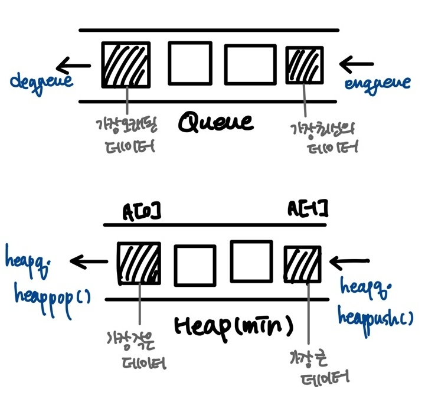

### ✔ 코드리뷰

#### **[자료구조는 정말 최고야]**

> **스택과 큐는 while문을 사용한다.** 

> **오름차순인지 확인하자.** 

> **각각의 비교값이 필요하다. (첫번째값부터!)** 

```python
stack = [11, 10, 8, 5]
comparison = stack.pop()

while len(stack) != 0:   #스택이 비어있는지 아닌지 계속 비교하기 ⭐
	if top > comparison:
		comparison = stack.pop()
```

```python
stack = [33, 4, 1, 5]

copmparison = stack.pop()

while len(stack) != 0:         
	if top > comparison:
		comparison = stack.pop()
    else:
        answer = "no"
        break
```


```python
# 최종 코드 

# input() : 느리다.
# sys.stdin.readline() : 빠르다. but 코테는 input()

answer = "yes"
#stack = [11, 10, 8, 5]  #되는 경우 
stack = [5, 1, 4, 3]   #무한반복이 일어나는 경우 

for stack ion stack_list:
#비교값을 pop 통해서 스택에서 꺼내온다. 
#5
comparison = stack.pop()
#스택이 비어있지 않을 때까지 
while len(stack) != 0:
    print(stack[-1], comparison)
#top comparison 비교 
	if stack[-1] > comparison:
    # pop을 사용해서 comparison 값을 갱신
    comparison = stack.pop()
    else:
     answer = "no"
     break

print(answer)
```


```python
for bracket in bracket:
	print(bracket)
	#괄호가 좌괄호이면 
	if bracket == left:
		#left stack push 
		left_stack.append(bracket)
		print(left_stack)

#괄호가 우괄호이면 
if bracket == right:
	#좌괄호 스택의 길이가 0이 아닐때
	#죄괄호 스택이 비어있지 않을 때 
	if len(left_stack) != 0:
	left_stack.pop()
    pritn(left_stack)
    
    #우괄호를 우괄호 스택에 push
    else:
        right_stack.append(bracket)
        
if len(left_stack) ==0 and len(right_stack)
```


---


## 1. 힙 heap, 셋 set

#### 💁‍♀️ **[참고자료](https://laboputer.github.io/ps/2017/10/06/priorityqueue/)**


### (1) 힙 heap 

>  일반적인 큐는 **순서를 기준**으로 가장 먼저 들어온 데이터가 가장 먼저 나가므로 **FIFO(FIRST IN FIRST OUT, 선입선출)** 방식

>  순서가 아닌 다른 기준므로는 ? HEAP이 필요한 경우 == HEAP의 USE CASE


##### (2) 우선순위 큐 

>  힙은 **우선순위 큐로 활용할 수 있는 데이터 구조**이다.

>  우선순위(중요도, 큳기 등 순서 이외의 기준)를 기준으로 **가장 우선순위가 높은 데이터가 가장 먼저 나가는 방식** 


◼ **순서가 아닌 우선순위를 기준으로(_다른 기준임을 주의!) 가져올 요소를 결정(dequeue) 하는 큐** 

> 1. 가중치가 있는 데이터 
>
> 2. 작업 스케일링
>
> 3. 네트워크


**◼ 이런 순서를 어떻게 코드를 작성해야할까?** 

> 1. 배열 
> 2. 연결 리스트
> 3. 힙 _ 배열과 연결리스트의 장점을 모아놓음 


##### (3) 우선순위 큐 구현 별 시간 복잡도 

|      연산 종류       | Enqueue 추가 |   Dequeue   |
| :------------------: | :----------: | :---------: |
|         배열         |     O(1)     |    O(N)     |
|    (정렬된 배열)     |     O(N)     |    O(1)     |
|     연결 리스트      |     O(1)     |    O(N)     |
| (정렬된 연결 리스트) |     O(N)     |    O(1)     |
|        **힙**        | **O(logN)**  | **O(logN)** |


#### EX ) 자, 알람시계, 마커 

>  이중에서 가장 짧은 것이 먼저 pop이 되어야하기 때문에 빠르게 나가고자 한다면 정렬된 상태로 유지를 해야한다. 


##### **(4) 힙의 특징** 

* **최대값 또는 최소값을 빠르게 찾아내도록** 만들어진 데이터 구조 

* 완전 이진 트리의 형태로 **느슨한 정렬 상태를 지속적으로 유지**한다. 

* **힙트리에서는 중복값을 허용한다.** 


##### (5) **힙은 언제 사용해야할까?** 

* **데이터가 지속적으로 정렬(느슨한) 되어야 하는 경우** 

* **데이터에 삽입/삭제가 빈번할때**


##### (6) 파이썬의 heapq 모듈

* 리스트인데 힙큐로 넘어가게 되면 느슨한 정렬 상태가 유지가 된다. 

* minheap 최소힙 으로 구현되어 있음 ( 가장 작은 값이 먼저 옴)

* maxheap 최대힙 (가장 앞부분에 가장 큰값이 들어가 있다.)

* 삽입, 삭제, 수정, 조회 **연산의 속도가 리스트보다 빠르다.**  (배열, 연결리스트, 힙으로 구현가능)


##### **(7) 큐와 힙의 사용법 비교** 



---

* **heapq.heapify(list) vs sort / 원본을 홰손한다.** 

* **heapq.heapify()  => 힙으로 만들다.**  
* **heapq.heappop(heap)**
* **heapq.heappush(heap, item)**

---

| 문제 번호 | 문제      |
| --------- | --------- |
| BOJ 1927  | 최소힙    |
| BOJ 11286 | 절대값 힙 |

---

◼  **최소 힙 _ 가장 기본적인 문제** 

```python
# 자연수 => 배열에 넣는 heapq pop push
# 0 => 가장 작은 값 제거 

import heeapq
heap = []
# heapify안해도됨

for _ in range(int(input())):
    n = int(input())
    
    if n ! = 0:
        heapq.heappush(heap, n)
    else:
        if len(heap) == 0:
            print(0)
        else:
            print(heapq.heapop(heap))

----

for number in numbers:
    if number != 0:
    	heap.heappush(numbers, number)
    else:
        if len(heap): #== 0 생략 가능 / 묵시적 형변환하여 핸들링
            print(0)
        else:
            print(heapq.heapopop(numbers))        
```


---


### (8) set (셋)

* **수학에서의 집합을 나타내는 데이터 구조로 python에서는 기본적으로 제공되는 데이터 구조** 

* **.add() / .remove() / + / - / & 교집합 / ^ 대칭차집합**


◼ set은 언제 사용해야할까?

>  데이터의 **중복이 없어야 할때** (고유값들로 이루어진 데이터가 필요할때)

> 정수가 아닌 데이터의 **삽입/ 삭제/ 탐색이 빈번히 필요할때** 


##### (9) set 연산의 시간 복잡도 

|  연산 종류  | 시간복잡도 |
| :---------: | :--------: |
|    탐색     |    O(1)    |
|    제거     |    O(1)    |
|   합집합    |    O(N)    |
|   교집합    |    O(N)    |
| 대칭 차집합 |    O(N)    |


##### (10) 백준 문자열 집합 

```python
#풀이 방식 1
cnt = 0
word_Set = set(s)

for word in words:
    if word in S: #11번이 반복
   #if word in set(s) #n번이 반복 / 형변환 가능
        cnt += 1
        
print(cnt)

#풀이 방식 2
print(len(set(words) & set(s)))

```

