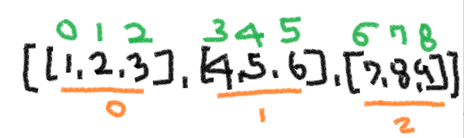
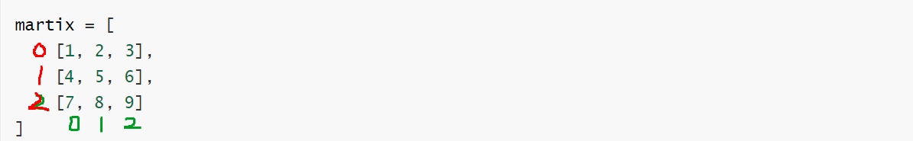
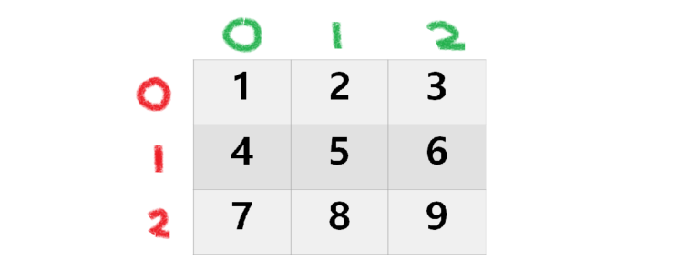
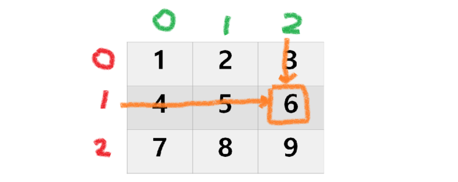
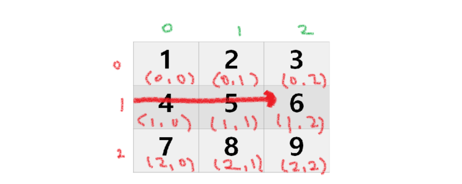
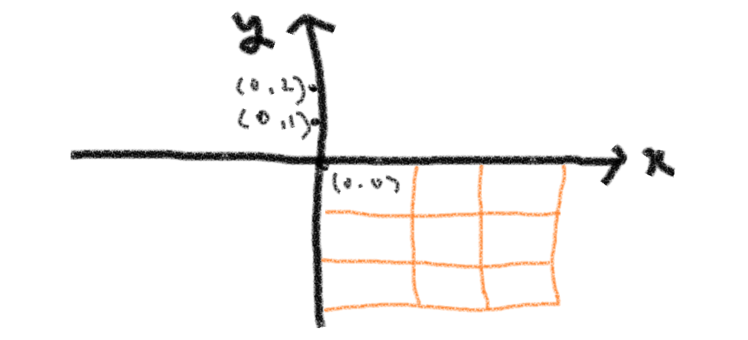

### ✔ 코드리뷰 

#### [절대갑 힙]

```python
# 가장 작은 요소가 항상 루트인 heap[0] = 가장 앞에 있는게 가장 작다. 
# [1, 3, -1, -2]
# heap은 맨앞에만 보면 된다. 
# 절대값이 가장 작은 값을 출력 = 우선순위 1. 절대값이 작은것 
# 절대값이 가장 작은 값이 여러개일 떄는 가장 작은 수 = 2. 실제 작은 값 
# [절대 값, 실제 값]
# heappush(heap, [abs(x), x])
# root  = heappop(heap)
# print(root[1])

# 파이썬에서의 heap은 최소힙이다. (가장 작은 값이 root로 온다.)
# 반대로 최대값은 어떻게 구현해야 할까? 

from heapq import
n = 18
heap =[]
x = [1, -1, 0, 0, 0, 1, 1, -1, -1, 2, -2, 0, 0]

# heappop 값을 뺼때 
root = heappop(heap)
```


#### [인사성 밝은 곰곰이]

```python
# enter는 새로운 사람이 채팅방에 입장 
# 새로운 사람이 입장한 이후 처음 채팅을 입력하는 사람은 반드시 곰곰티콘으로 인사를 한다. 
# 닉네임 모두 저장 
# set.add(닉네임)
# set.add(닉네임)
# 곰 += 1
if name not in 
# set.clear()
if name == "enter"
set.clear()


----------------------------------------

n = 7
gom = 0
log_list =[
    "enter"
    "......"
    "chansol"
]

set_ = set()
for log in log_list:
    if log == "enter":
        set_.clear()
    else:
    #닉네임 = log
    if log not in set_:
        set_.add(log)
        gom += 1
print(gom)

# 리스트에서 중복을 탐색할 떄는 n 만큼의 시간이 필요
# 셋에서 중복을 탐색할 떄는 1만큼의 시간이 필요
```


---


### ⭐ 1. 2차원 리스트 _(세상을 표현하는 방식)

##### (행렬 중요)

> * **Tensor flow**  
>
> : **딥러닝 프로그램**을 쉽게 구현할 수 있도록 다양한 기능을 제공해주는 라이브러리 
>
> : **기계 학습 라이브러리** 
>
> : 2020/05/06 구글 브레인팀 
>
> : Tensor  => 선형 관계를 나타내는 다중선형대수학의 대상
>
> **추천 )  youtube : linear algebra = 3blue brown**


◼ **이차원 리스트는 리스트를 원소로 가지는 리스트일 뿐이다.** 

```python
matrix = [[1,2,3], [4,5,6], [7,8,9]]
```



```python
print(martix[0][0])
>>>>1

pritn(martix[1][2])
>>>>6

pritn(martix[2][0])
>>>>7
```


```python
# 보기 좋게 변경하면 행렬 (martix)의 형태가 나온다. 

martix = [
    [1, 2, 3],
    [4, 5, 6], 
    [7, 8, 9]
]
```




**◼ point : 어떻게 순회하지 ? = for문을 통해 순회하는 방식 _ 머리속으로 구상할 수 있어야한다.** 


```python
# 이차원 리스트는 행렬(matrix) 이다. 
# index를 보는 것이 중요하다. 
 
martix = [
    [1, 2, 3],
    [4, 5, 6], 
    [7, 8, 9]
]
```




```python
martix = [
    [1, 2, 3],
    [4, 5, 6], 
    [7, 8, 9]
]

print(matrix[1][2])
>>>>>>6
```



  

---

◼ **튜플로도 비슷하다. (수학시간에는 좌표값)**





---


###  2. ⭐특정 값으로 초기화 된 이차원 리스트 만들기


##### (1) 직접 작성 (4 x 3 행렬)

```python
matrix_1 = [[0, 0, 0], [0, 0, 0], [0, 0, 0], [0, 0, 0]]

matrix_2 = [
    [0, 0, 0],
    [0, 0, 0],
    [0, 0, 0],
    [0, 0, 0]
]
```


##### (2) 반복문으로 작성 (100 x 100 행렬)

```python
matrix = []
for _ in range(100):
    matrix.append([0] * 100) 

Print([0] * 2)
#출력 [0][0]

Print([1] * 2)
#출력 [1][1]
```


```python
from pprint import pprint

matrix = []

for _ in range(10):
	matrix.append([0] * 10)
    
print(matrix)
pprint(matrix)

#출력 : 행렬처럼 깔끔하게 나오는 것을 확인할 수 있다. 
```


##### (3) 반복문으로 작성 (n x m 행렬)

```python
n = 4 #행
m = 3 #열
matrix = []

for _ in range(n):
    matrix.append([0] * m)

print(matrix)

# [[0, 0, 0], [0, 0, 0], [0, 0, 0], [0, 0, 0]]
```

---

##### **n = 행의 개수**  

##### **m = 열의 개수**  

##### ⭐ (n x m 행렬) = 개수  

---


### 3. 리스트 컴프리헨션으로 작성 (n x m 행렬)

```python
n = 4
m = 3

matrix= [[0] * m for _ in range(n)]
print(matrix)
# [[0, 0, 0], [0, 0, 0], [0, 0, 0], [0, 0, 0]]
```


#### ✔ 행렬은 내부에 무조건 값이 존재해야한다. 

```python
from pprint import pprint

matrix = []

#for _ in range(10):
#	matrix.append([0] * 10)

=> 다음과 같이 작성 할 수 있다. 

matrix = [[0] * 10 for _in range(10)] #⭐외우기 보다 이해하기 
pritn(matrix)


# n x m
# n : 행의 개수 
# m : 열의 개수 
n = 10
m = 10

```


#### ◼ 이중리스트 

```python
matrix1 = [[0] * m for _in range(n)]
pprint(matrix1)

matrix2 = [[0] * m] * n
#[[0, 0, 0, 0, 0]]

pprint(matrix2)

# 결과는 같지만 실제로 완전히 같지 않다. 
# 파이썬 튜터로 확인한 결과 주소값이 다른 것을 확인할 수 있다. 
```


---


### 📢 주의 리스트 컴프리헨션 VS  리스트 곱셈 연산

```python
n = 4 #행
m = 3 #열

matrix1 = [[0] * m for _ in range(n)]
matrix2 = [[0] * m] * n

# 원소값 병경 
matrix1[0][0] = 1
matrix2[0][0] = 1

print(matrix1)
>>> ????
print(matrix2)
>>> ????
```

 

---


### 2. 입력받기 

(1) 행렬의 크기가 미리 주어지는 경우 _ 체스판 

```python
matrix = []

for _ in range(8):
    line = list(input())
    matrix.append(line)

# 규칙을 찾아내야 한다. 
# 합이 짝수 
# 짝수 홀수 
# 코드의 방향성 잡아갈 수 있다. 
```


1_ 일단 초기화를 먼저 해준다. 

2_ 입력값을 그대로 2차원 리스트 해준다. 

3 _ 왜 list만 해줘도 될까 ? = > 다 이어져 있기 때문이다. / 요소들이 붙어있다. 


----


~~~python
```
3x3 크기의 입력을 받아보자 

1 2 3
4 5 6
7 8 9
```

matrix = []

#초기화를 시키고 3줄 반복하는 입력이라서 3줄을 나눠서 받아주기 
for _ in range(3):
    line = list(map(int, input().split()))
    matrix.append(line)
    
    
matrix = [list(map(int, input().split())) for _ in range(3)]
# 리스트 컴프리헨션을 통해 이차원 리스트의 입력을 간단히 받을 수 있다. 
~~~


