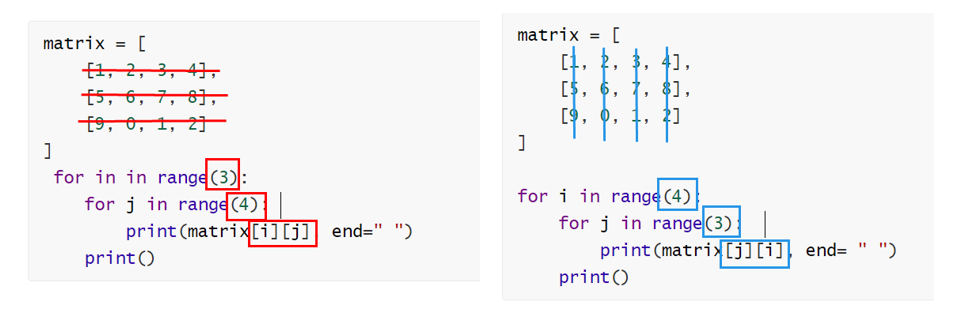

### ✔코드리뷰

**[유니크]** _1차원을 2차원으로 만들어 보는 연습이 필요함.

> 다음과 같이 2차원 리스트를 만들어줬다. 

100 100 63 99 89

99 97 89 99 97

98 92 63 99 98

```python
for x in range(3):
	for y in range(5):
        
        
열_리스트 = []
for x in range(3):
    	duf = []
        for y in range(5):
            열.append(리스트[y][x])
```

```python
col_list =[]
#리스트를 90도 회전 
for x in range(3):
    col = []
    for y in range(5):
        col.append(list_[y][x])
        
    col_list.append(col)
```


**[2차원 배열의 합]**  다음과 같이 2가지 방법이 있다. 

```python
# 방법 1
list_ = [[0, 1], [2, 3]]
for y in range(2):
    for x in range(2):
        print(list_[y][x])
       
# 방법 2
list_ = [[0, 1], [2, 3]]
for x in range(2):
    for y in range(2):
        print(list_[x][y])
```

```python
for r in range(0, 2):
	for c in range(0, 2):
		sum_ += list_[r][c]
```

```python
# 코드리뷰 

list_ = [[1, 2, 4], 
         [8, 16, 32]]
i, j, x, y = 1, 1, 2, 2 

i -= 1
j -= 1
x -= 1
y -= 1

sum_ = 0
#이중 반복문 
# i => x
for r in range(i, x+1):
    # j => y
    for c in range(j, y+1):
        sum_ += list_[r][c]
print(sum_)

#파이썬 제출 시간 초과는 pypy3로 재제출하는 것을 추천 
```


---

### 📜 아침 리뷰 

* **문제 이해도 시간 단축** ) 문제를 노트에 쭉 적고 필요없는건 밑줄치고 지우고 필요한 것만 하이라이트 했더니 문제 이해에만 1시간 걸리던게 20분 정도 줄었다. 

* ⭐⭐⭐

  **코드 리뷰** - 리뷰할 때 너무 버벅거려서 문제 이해도가 낮은 것 같아 문제 하나를 아예 **스크립트**를 만들었다.

*  연습장 한장정도 나오던데 그렇게 대본을 만들다 보니 잘 풀리는 것 같다는 의견 

* 문제해결의 핵심은 이해가 핵심이다. 이론과 그 이론을 활용하는 것이 힘든건 당연 
* 300문제 400문제 풀다보면 더 이해 할 수 있을때가 온다. 
* 정말 무식하게 하기 

* IM > 카카오 2번 / 그래프 > 인접행렬
* **문제많이 푸는 것을 추천한다.**

---

### 1.  2차원 리스트 _ 순회 

이차원 리스트를 단순히 출력하면 아래와 같다. 

```python
matrix = [

]

print(matrix)
>>>[[], [], []]
```

```python
# 정말 행렬처럼 풀고 싶다면 어떻게 풀어야 할까? 
# 인텍스를 통해 각각 출력하면 가능하다. 
# 초심자 코드 

matrix = [
	[1, 2, 3, 4],
	[5, 6, 7, 8],
	[9, 0, 1, 2]
]

print(matrix[0][0], matrix[0][1], matrix[0][2], matrix[0][3])
print(matrix[1][0], matrix[1][1], matrix[1][2], matrix[1][3])
print(matrix[2][0], matrix[2][1], matrix[2][2], matrix[2][3])

#이런 형태 어디서 봤더라? 3번 돌릴 수 있는 반복문을 생각해 볼 수 있더라 
#하지만 이차원 리스트의 크기가 100x 100이라도 어떻게 출력할 수 있을까 라는 것을 고민하기

>>> 1 2 3 4
>>> 5 6 7 8
>>> 9 0 1 2
```


##### (1) 이중  for 문을 이용한 **행,  열 우선 순회**

```python
# 이 문제 자체의 원리를 이해하는 것이 중요하다. 

matrix = [
	[1, 2, 3, 4],
	[5, 6, 7, 8],
	[9, 0, 1, 2]
]

----------------------------------------------------
# 만약 n x m 이라면, (일반화)
# 행 우선 순회 하려면 어떤 프로그래밍 언어가 필요할까?
# length를 구하면 된다. 
n = len(matrix)
m = len(matrix[0])

for i in range(n):
    for j in range(m):
        print(matrix[i][j], end = " ")
	print()
------------------------------------------------------

# (1)
for row in matrix:
    print(row)
# 출력 
# [1, 2, 3, 4]
# [5, 6, 7, 8]
# [9, 0, 1, 2]

# (2)
# 요소들을 보고 싶다면, 
for row in matrix:
    for elem in row:
        print(elem, end="")
    print()
# 출력
# 1, 2, 3, 4
# 5, 6, 7, 8
# 9, 0, 1, 2
-------------------------------------------------------


```

```python
# 행 우선 순회 
matrix = [
    [1, 2, 3, 4],
    [5, 6, 7, 8],
    [9, 0, 1, 2]
]
# 하지만 이차원 리스트 크키가 100 x 100이라도 이렇게 출력할 수 있을까?
# 따라서 이중 반복문을 통해 순회하며 이차원 리스트를 출력한다. 
for in in range(3): #행   # 0 1 2 
    for j in range(4): #열  # 0 1 2 3    # 하나의 행을 출력 
        print(matrix[i][j], end=" ")
    print()

>>> 1 2 3 4
>>> 5 6 7 8
>>> 9 0 1 2

```

```python
# 열 우선 순회 

# 3x4 에서 4x3 이된다. 
# 그래서 바깥쪽 for문은 4가 되는 것이다. 

# 뒤쪽이 어떻게 증가하는지 알아야 하기 때문 (숫자의 변화)
# ⭐고정된 값을 먼저 확인 
# 외워서 사용하기 보다 사용할때 마다 n x m으로 설정해놓고 하기 
# ⭐일반 규칙을 풀어내는 능력이 중요하다. 


matrix = [
    [1, 2, 3, 4],
    [5, 6, 7, 8],
    [9, 0, 1, 2]
]

for i in range(4):
    for j in range(3):   # 하나의 열을 출력 
        print(matrix[j][i], end= " ")
    print()
#[i] 0 1 2 0 1 2 0 1 2
#[j] 1 2 3 4 .....

>>> 1 5 9 
>>> 2 6 0
>>> 3 7 1
>>> 4 8 2 
```


```python
matrix = [
    [1, 2, 3, 4],
    [5, 6, 7, 8],
    [9, 0, 1, 2]
]

for i in range(4):
    for j in range(3):  
        print(matrix[j][i], end= " ")
    print()
    
```


##### (2) 행 우선순회 VS 열 우선순회




---


##### (3) 행 우선 순회를 이용해 이차원 리스트의 총합 구하기

```python
matrix = [
	[1, 1, 1, 1],
	[1, 1, 1, 1],
	[1, 1, 1, 1]
]

total = 0 

for i in range(3):
    for j in range(4):
        tatap += matrix[i][j]
print(tatal)
>>>12
```

```python
# PYTHONIC 한 방법으로 이차원 리스트의 총합 구하기 
matrix = [
	[1, 1, 1, 1],
	[1, 1, 1, 1],
	[1, 1, 1, 1]
]

total = sum(map(sum, matrix))  # 왜 map이 나왔는지 고민해보기 # 개념 이해 
print(taotal)
```


```python
# 응용코드 

matrix = [
	[1, 2, 3, 4],
	[5, 6, 7, 8],
	[9, 0, 1, 2]
]


#1
for i in range(n):
    for j in range(m):
        tatal += matrix[i][j]
pritn(total)


#2 
for row in matrix:
    total += sum(row)
    #sum(row) #임시적으로 row에 들어가있기 때문
    
#3
print(sum(matrix))  #오류 생김 
```

```python
# 리스트 map을 활용하여 sum 먹이기 
# map 

map(어떤 함수, matrix)

map(sum, matrix)
```


```python
def matrix_sum(matrix): # 함수화 된 것 이해할 수 있도록 하기 
	return sum(map(sum, matrix))
	
=> matrix_(matrix) # 로 줄일 수 있음 
```


---


* 행 우선 순회를 이용해 이차원 리스트의 최대값, 최소값 구하기 

```python
# 최대값 
matrix = [
    [0, 5, 3, 1],
    [4, 6, 10, 8],
    [9, -1, 1, 5]
]

max_value = 0

for i in range(3):
    for j in range(4):
        if matrix[i][j] > max_value:
            max_value = matrix[i][j]
print(max_value)
>>> 10


# 최소값 
matrix = [
    [0, 5, 3, 1],
    [4, 6, 10, 8],
    [9, -1, 1, 5]
]

min_vlaue = 99999999

for i in range(3):
    for j in range(4):
        if matrix[i][j] < min_value:
            min_value = matrix[i][j]
print(min_value)
>>> -1
```


#### 👉 시간 복잡도 O(n^2)


---


```python
# 파이썬하게 이차원 리스트의 최대값 최소값 구하기 

matrix = [
    [0, 5, 3, 1],
    [4, 6, 10, 8],
    [9, -1, 1, 5]
]
max_value = max(map(max, matrix))
mim_value = min(map(min, matrix))

print(max_vlaue)
>>>10

print(min_vlaue)
```

---


* ##### 이차원 리스트 순회 연습 정답

```python
list_a = [list(map(int, input().split())) for i in range(2)]
list_b = [list(map(int, input().split())) for i in range(2)]
list_c = [[0] * 3 for _in range(2)]

# 두 배열의 같은 위치끼리 곱하여 새로운 이차원 리스트에 젖아 
for i in range(2):
	for j in range(3):
		list_c[i][j] = list_a[i][j] * list_b[i][j]
# 결과 출력 
for i in range(2):
	for j in range(3):
		print(list_c[i][j], end= " ")
	print()
```


----

### 2. 전치 (행과 열을 바꾸는)

>  **transpose 전치 란** 행렬의 행과 열을 서로 맞바꾸는 것을 의미 한다. 

```python
matrix = [
    [1, 2, 3, 4],
    [5, 6, 7, 8],
    [9, 0, 1, 2]
]

# 전치 행렬을 담을 이차원 리스트 초기화 (행과 열의 크기가 반대 )
transposed_matrix = [[0] * 3 for _in range(4)] 

for i in range(4):
	for j in range(3):
        transposed_matrix[i][j] = matrix[j][i] # 행, 열 맞바꾸기 
        
```


---


### 3.  회전 (행렬을 돌리는..)

##### (1) 왼쪽으로 90도 회전하기 

```python
matrix = [
	[1, 2, 3],
    [4, 5, 6],
    [7, 8, 9]
]
n = 3
rotated_matrix = [[0] * n for _ range(n)]

for i in range(n):
    for j in range(n):
        rotated_matrix[i][j] = matrix[j][n-i-1] #왼쪽 오른쪽 회전이 각각 어떻게 동작하는지 파악
```


##### (2) 오른쪽으로 90도 회전하기 

```python
matrix = [
	[1, 2, 3],
    [4, 5, 6],
    [7, 8, 9]
]

n = 3
rotated_matrix = [[0] * n for _ in range(n)]

for i in range(n):
    for j in range(n):
        rotated_matrix[i][j] = matrix[n-j-1][i]#왼쪽 오른쪽 회전이 각각 어떻게 동작하는지 파악
```


